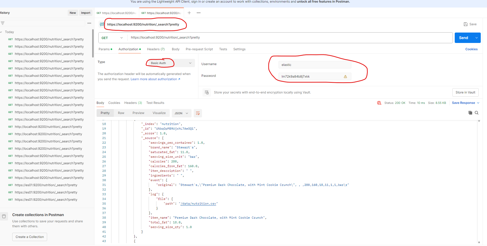

## Elasticsearch Sources code 
https://www.elastic.co/guide/en/elasticsearch/reference/current/docker.html

https://github.com/elastic/elasticsearch/tree/8.16/docs/reference/setup/install/docker

## Setup
```sh
docker-compose -f elk/docker-compose.yml up -d
docker-compose -f elk/docker-compose.yml down -v
docker-compose -f elk/docker-compose.yml ps
```

## Set vm.max_map_count 
```sh
## This is helful to avoid some error with docker.

## Set the Value Temporarily: Run the following command on the Docker host:
sudo sysctl -w vm.max_map_count=262144

## Set the Value Permanently: Add the following line to `/etc/sysctl.conf` to make the change permanent: 
vm.max_map_count=262144

## Apply the change: 
sudo sysctl -p
```

## Access ElasticSearch
Please use https
```
https://localhost:9200
Username: elastic
Password: lm72k9a84b8j7xkk
```

## Kibana access
```
http://localhost:5601/
Username: elastic
Password: lm72k9a84b8j7xkk
```
## ## get data with postman
https://es01:9200/nutrition/_search?pretty
